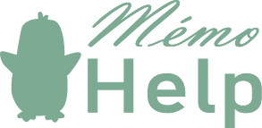

---

## Notre projet

Imaginez une application qui transformerait le suivi médical en une expérience plus ludique et motivante. C’est ce que nous proposons avec notre application MemoHelp, le Tamagotchi de la santé.

Le concept est simple : chaque patient prend soin d'une mascotte virtuelle qui reflète son état de santé. Cette mascotte devient un compagnon qui évolue en fonction des actions du patient.

Notre objectif c’est de gamifier les soins pour motiver les patients à prendre soin d'eux-mêmes de manière plus proactive et réduire leurs inquiétudes.

Nous utilisons deux modèles d'intelligence artificielle : [mtheo/camembert-base-xnli](https://huggingface.co/mtheo/camembert-base-xnli) pour la classification des messages des patients afin de définir l'etat du tamagotchi et [llama3](https://ollama.com/library/llama3) pour la génération de résumés de l'état de santé.

Nous utilisons Python avec FastAPI pour le backend et React pour le front-end, permettant une évolution future vers une application, PWA, ou un widget mobile.

## Gestion de projet

[FigJam](https://www.figma.com/board/PTV8f1xVneB9qQ2ko59UaP/Hackathon?node-id=0-1&t=sHvEr7sJSF5p0geu-1) pour le brainstorming

[Figma](https://www.figma.com/design/8Oc5ge8g2GTtTrufh9cecv/M%C3%A9mogochi?node-id=0-1&t=DMMJiVorLbPWm1Pd-1) pour la création des états de la mascotte et le design de l'application web

## Equipe de développement

| Nom         | Prenom   | Pseudo Git     |
|-------------|----------|----------------|
| Dubuisson   | Théo     | Teyo01         |
| Le Gloannec | Erwan    | Quozul         |
| Morin       | Laurie   | mlaurie        |
| Traore      | Chiekhou | chiekhou       |
| Wadoux      | Nicolas  | Wadoux-Nicolas |

## Equipe marketing

| Nom    | Prenom |
|--------|--------|
| Harrer | Margot |

## Fonctionnalités et membres

| Fonctionnalité                                                                        | Développeur.s                               |
|---------------------------------------------------------------------------------------|---------------------------------------------|
| Carte du résumé des informations du patient<br>généré par IA                          | Nicolas (front), Théo (front), Erwan (back) |
| Création des états de la mascotte (figma)                                             | Nicolas, Laurie, Théo, Erwan                |
| Implémentation de la mascotte selon les messages                                      | Nicolas, Théo                               |
| Echange de messages avec classification<br>pour déterminer l'état du pingouin/patient | Chiekhou (back), Nicolas (front)            |
| Bulle d'information déterminant le message à<br>l'origine de l'état du pingouin       | Laurie, Théo                                |
| Bulle des actions que le patient doit réaliser                                        | Erwan, Laurie                               |

## Lancer le projet

### Avec Docker

```shell
docker compose up
```
- Accès à la Web App : http://localhost:80/
- Accès à l'API : http://localhost:8000

### Sans Docker

Voir les README dans chacun des sous-dossiers `front` et `back`

---

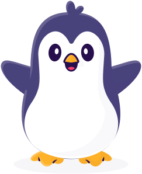
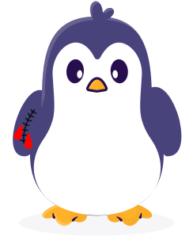
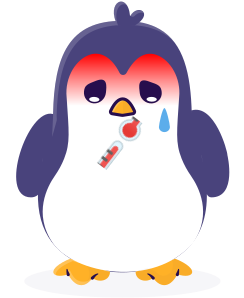
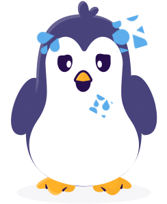
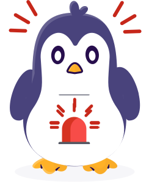
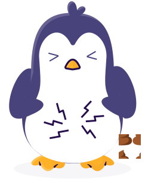
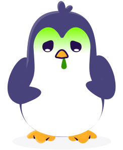
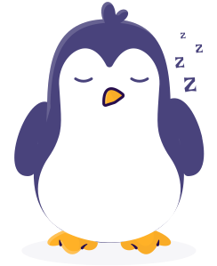
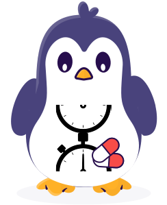
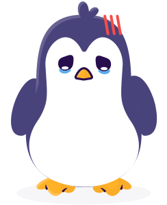
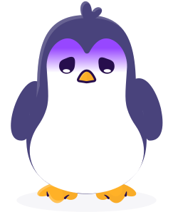
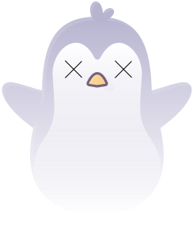


